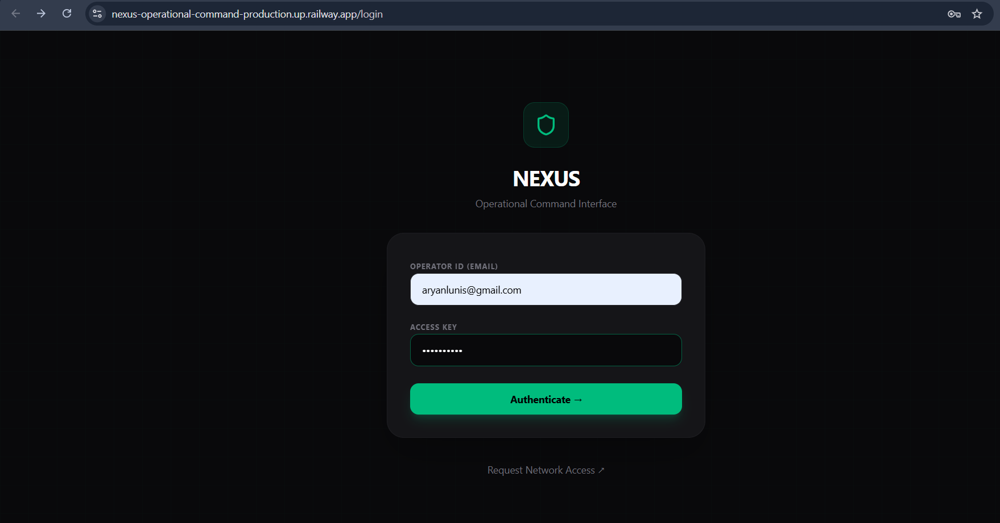
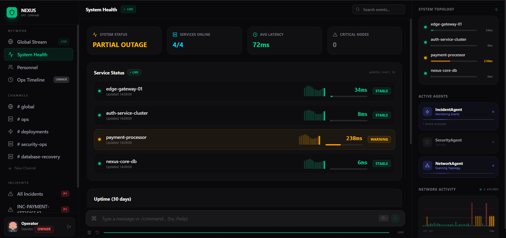

# NEXUS — Operational Command Platform

> A real-time operational command interface that simulates how engineering organizations monitor infrastructure, coordinate operators, and respond to incidents.

NEXUS is designed to replicate the internal tools used by distributed engineering teams to monitor system health, detect incidents, and coordinate responses across services in real time.

Instead of relying on external communication tools, organizations often build their own internal operational platforms where commands, alerts, and system events flow instantly between operators and infrastructure.

NEXUS recreates that environment.

---

# Live Demo

You can try the deployed platform here:

https://nexus-operational-command-production.up.railway.app/login

### Owner Login

Email
```
aryanlunis@gmail.com
```

Password
```
Aaryan2005
```

### Observer Login

Email
```
observer@nexus.dev
```

Password
```
observer123
```

The Owner account provides full system access including command execution and operational monitoring.

The Observer account allows you to explore the system from a limited role perspective.

---

# Requesting Access

Users who do not yet have access can request credentials through the **Network Access Request Portal**.

Navigate to:

```
/signup
```

You will see the **Request Network Access** interface.

Users can submit:

- Full Name
- Job Title
- Email
- Password

Once submitted, the request is authenticated through **Supabase authentication**, and a corresponding user profile is created in the system database.

After approval, the user becomes an authenticated operator in the platform.

# Screenshots

### Login Interface


### Global Operational Stream


### System Health Monitoring


### Personnel Management


### Operations Timeline


---

# System Overview

NEXUS simulates an internal **operations command center** used by engineering teams to monitor infrastructure and respond to incidents.

The platform revolves around several interconnected systems working in real time.

### Global Stream

A real-time event feed where all operational activity appears instantly.

This includes:

- AI agent alerts
- operator commands
- deployments
- incident creation
- topology scans
- system reports

Every event flowing through the system becomes visible here.

---

### System Health Dashboard

The system health view continuously monitors infrastructure nodes.

Each service displays:

- live latency
- operational status
- warning or critical alerts
- uptime history

Latency values update automatically every few seconds based on simulated infrastructure conditions generated by the network monitoring agent.

---

### Personnel Management

The Personnel section displays active operators in the system.

Each user has a role that determines their level of control.

Roles include:

- Owner
- Admin
- Operator
- Member

Role-based access ensures that only authorized users can execute commands or perform administrative actions.

---

### Incident Management

Operators can create incidents directly from the command interface.

Example:

```
/incident payment latency spike
```

When triggered:

1. A new incident record is created in the database
2. A dedicated incident response room is generated
3. The event is broadcast across the system

Incidents can later be resolved using:

```
/resolve INCIDENT_ID
```

---

### Operational Timeline

The Operational Timeline provides a complete audit log of system activity.

This view tracks:

- operator commands
- agent actions
- system events
- incident changes

Only users with elevated privileges (such as the Owner role) can view this timeline.

---

# Command Driven Operations

Operators interact with the system through commands similar to those used in internal DevOps tooling.

Available commands include:

| Command | Description |
|------|------|
| `/incident [service] [reason]` | Creates a P1 incident room |
| `/scan [target]` | Network agent scans infrastructure |
| `/status [service]` | Returns current service status |
| `/deploy [service] [version]` | Deploys new version |
| `/alert [message]` | Broadcast alert to system |
| `/rollback [service]` | Initiates rollback |
| `/resolve [incidentId]` | Resolves an incident |
| `/help` | Lists available commands |

Commands trigger real-time responses from system agents.

---

# AI Agent System

NEXUS includes autonomous monitoring agents that continuously observe system activity.

### IncidentAgent

Detects operational anomalies such as:

- latency spikes
- service errors
- timeouts
- system crashes

When a Gemini API key is configured, the agent performs AI-driven analysis to evaluate the event and generate reasoning.

If no API key is provided, the system falls back to heuristic analysis.

---

### SecurityAgent

Monitors the system for suspicious signals including:

- unauthorized access
- unusual authentication patterns
- simulated intrusion attempts

The agent occasionally generates simulated threat alerts to test system response.

---

### NetworkAgent

Responsible for monitoring infrastructure topology.

The agent performs:

- periodic latency scans
- topology health reports
- spike detection
- automatic recovery simulation

Latency drift and spike behavior simulate real-world network instability.

---

# Infrastructure Topology

The system includes a simulated infrastructure environment containing several services:

```
edge-gateway-01
auth-service-cluster
payment-processor
nexus-core-db
```

Each node reports:

- latency
- operational state
- health warnings

These metrics drive the **System Health dashboard and Network Activity visualization**.

---

# Technology Stack

### Frontend

React  
Vite  
TypeScript  
TailwindCSS  
Zustand state management  
Framer Motion animations  

---

### Backend

Node.js  
Express server  
WebSocket-style event streaming through Supabase Realtime

---

### Database

Supabase (PostgreSQL)

Tables used:

```
users
rooms
events
incidents
systems
agent_actions
```

Row Level Security ensures role-based access across the platform.

---

### AI Integration

Google Gemini 1.5 Flash

Used for:

- anomaly analysis
- event reasoning
- signal classification

Integration handled through:

```
@google/genai
```

---

### Deployment

The platform is deployed using:

Railway

The Express server hosts the React application and provides the runtime environment for the operational platform.

---

# Supabase Integration

Supabase acts as the backbone of the system architecture.

### Authentication

Supabase Auth manages:

- user registration
- login sessions
- identity validation

When a user signs up:

1. A record is created in `auth.users`
2. A corresponding profile is inserted into the `users` table
3. The user is assigned a role

---

### Real-time Event Streaming

The event system is powered by Supabase Realtime subscriptions using:

```
postgres_changes
```

This allows:

- instant updates across clients
- real-time dashboards
- synchronized system activity

---

### Incident Tracking

Incidents created through commands are stored in the `incidents` table.

These records include:

- severity
- status
- creation timestamp
- resolution data

---

### Operational Rooms

Rooms represent communication channels for operational coordination.

Examples include:

```
#global
#ops
#deployments
#security-ops
```

Incident commands automatically create dedicated incident response rooms.

---

# Project Structure

```
src
├── App.tsx
├── hooks
│   ├── useEvents.ts
│   └── useOperationsTimeline.ts
├── services
│   ├── agentEngine.ts
│   └── eventService.ts
├── store
│   └── useNexusStore.ts
├── lib
│   └── supabaseClient.ts
└── utils
    └── seeder.ts
```

---

# Running the Project Locally

Install dependencies:

```
npm install
```

Create an environment file:

```
cp .env.example .env
```

Add the following variables:

```
VITE_SUPABASE_URL
VITE_SUPABASE_ANON_KEY
GEMINI_API_KEY
```

Start the development server:

```
npm run dev
```

The application will start at:

```
http://localhost:3000
```

---

# What This Project Demonstrates

NEXUS showcases how modern operational systems combine:

- real-time event streaming
- AI-driven monitoring
- role-based access control
- distributed infrastructure visualization
- incident response workflows

The platform demonstrates a simplified model of internal operational tools used by engineering organizations to monitor infrastructure and coordinate responses across teams.
